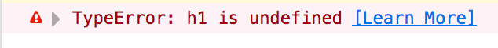

# Dynamic Pages with the DOM and Javascript

In order to add interactivity to web pages and build interactive data visualizations, it's important to understand how Javascript manipulates a web page. Step 1 is understanding that Javascript is not directly changing the HTML, but working with a *representation of the web page* known as the [Document Object Model][].

[Document Object Model]: https://www.w3schools.com/js/js_htmldom.asp

> "The Document Object Model (DOM) is the data representation of the objects that comprise the structure and content of a document on the web...The Document Object Model (DOM) is a programming interface for HTML and XML documents. It represents the page so that programs can change the document structure, style, and content. The DOM represents the document as nodes and objects. That way, programming languages can connect to the page." ~ [Introduction to the DOM][] (MDN)

Here's an [image from W3C] that illustrates the above definition point:

[image from W3C]: http://www-db.deis.unibo.it/courses/TW/DOCS/w3schools/js/js_htmldom.asp.html


## The DOM in practice

When you "View Source" on a web page, you're seeing the raw HTML of the page. This typically includes a header with references to stylesheets and code (or perhaps inline styles and code); image references; and tags for headlines, paragraphs, and many other page elements.

When you open a browser's developer toolbar, you're seeing the Document Object Model -- i.e. the data representation of the HTML document as the browser and Javascript see it. It's the DOM that you manipulate programmatically via Javascript.

## Exercise

### Waiting for the DOM

Because the DOM is created by the browser, you need to ensure that page elements targeted by code have been created in the DOM before you attempt to work with them in Javascript.

If a page element doesn't yet exist in the DOM and you try to change it's style or text, you will get an error.

*This is a frequent source of confusion for new Javascript programmers.*

A quick exercise should help demonstrate the issue. Below, we attempt to add some basic Javascript to update the text of the `H1` element. It does not go so well...

* Clone this repo: `git clone git@github.com:zstumgoren/js-exercises.git`
* Open `exercises/1/page.html` file from this repo in your browser (*make sure you open the locally downloaded copy, not the copy on Github*)
* Open the browser's developer toolbar and go to the `Console` tab
* Add the below script to the `header` element in `page.html`:
    ```
    <script>
      var h1 = document.querySelector("h1");
      h1.innerText = "Testing, 1...2...";
    </script>
    ```
* Now reload the page. 

You should see an error in the console:




Questions: 

* What does this error mean?
* Why does it happen?
 
> *HINT 1:* Try clicking the `Learn More` link in the console error to get more details on the nature of the error.

> *HINT 2:* In the developer toolbar, [set a breakpoint][] in the Javascript where the `h1` element is selected, then step through the code to see what happens.

So we understand the nature of the problem. Is there a way to fix this error while keeping the script tag and the code it contains somewhere *inside the HTML document*?

> *HINT:* Try moving the original script tag elsewhere in the document.

What about putting the Javascript in an external file? Does this resolve the problem? Is there a way to follow the best practice of externalizing Javascript *and* resolve the issue?

*HINT:* Check out the [`<script>` tag documentation][].

[set a breakpoint]: https://developer.mozilla.org/en-US/docs/Tools/Debugger/How_to/Set_a_breakpoint
[`<script>` tag documentation]: https://www.w3schools.com/tags/tag_script.asp
[Introduction to the DOM]: https://developer.mozilla.org/en-US/docs/Web/API/Document_Object_Model/Introduction